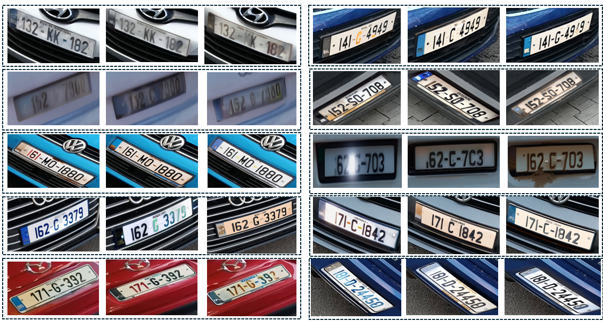
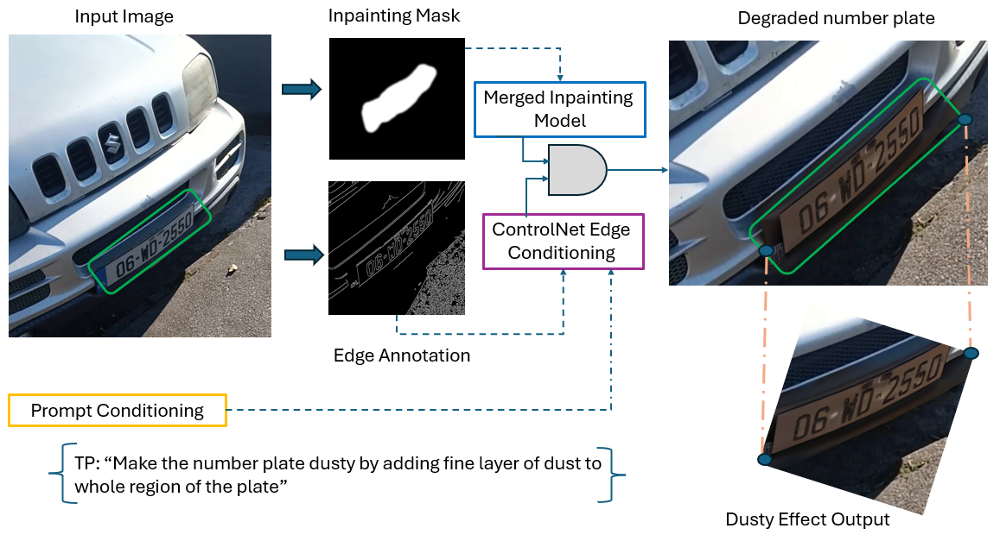

# Diffusion-Based Number Plate Degradation and Synthetic Dataset

<p align="center">
  
</p>


This repository contains the code, dataset, and benchmarks for our project on **synthetic number plate degradation** using **diffusion-based inpainting pipelines**.  
We introduce a framework to generate realistic degradations (dust, blur, occlusion, shadow, lighting effects) on clean number plates, enabling robust OCR evaluation and training.

---

## 🔍 Project Overview
Real-world Automatic Number Plate Recognition (ANPR) systems often fail under adverse conditions such as dust, blur, or occlusion.  
To address this, we propose a **diffusion-based degradation pipeline** that simulates realistic distortions for **OCR model validation and robust training**.  

Our contributions:
- A **synthetic dataset** of degraded number plates.
  
- A **pipeline** using merged diffusion models, ControlNet, and prompt-driven inpainting.
  <p align="center">
  
</p>
 
- **OCR validation benchmarks** to evaluate robustness against degradations.

---

## 📂 Dataset: *Degraded Number Plate*
The dataset contains **30 unique clean number plates** with corresponding degraded versions.

| Component | Count / Description |
|-----------|---------------------|
| Total Unique Plates | 30 |
| Clean Plate Images | 30 |
| Masked Regions | 30 |
| Canny Edge Maps | 30 |
| Cropped ROI Plates | 30 |
| Full Plates with Degradations | 90 (3 per plate) |
| Types of Degradations | Dust, Blur, Occlusion, Lighting |

👉 The dataset is available under the folder [`dataset/`](dataset/)  


---

## ⚙️ Pipeline Overview
Our pipeline combines:
- **Base SDXL diffusion model**
- **Inpainting model (fine-tuned on plate masks)**
- **ControlNet with edge conditioning**
- **Prompt-driven degradation synthesis**


---

## 🛠 Installation
Clone the repository:
```bash
git clone https://github.com/your-username/numberplate-degradation.git
cd numberplate-degradation
